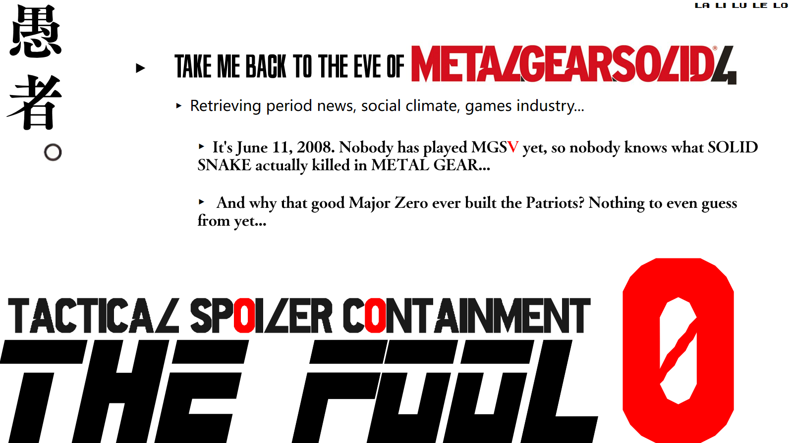

<div align="center">

**English** · [简体中文](README.md)

</div>


**An agent skill for playing old games. It hands you what the original audience had, and it won't spoil the rest.**



---

## What it does

### 1. It equips you as a player from that year

This is the main job.

Half the reason old games feel unplayable isn't the game. It's that you're missing everything the original audience got for free: what those graphics counted as at the time, what everyone was waiting to see, which questions the previous installment had left hanging, which controls were simply normal back then.

The important part is **the open questions**. In June 2008, the entire audience was arguing about what was really going on with Ocelot's arm and who was on the list of twelve. Today you can settle either one in three seconds, so those questions never spend a single day alive in your head.

It goes and digs through period forums, magazine previews and the reaction to the trailers, then puts those questions back where they belong. This part runs on actual retrieval, not on the model's memory. If it can't find anything, it says so instead of inventing a past.

### 2. It doesn't volunteer spoilers

Note the word *volunteer*. It will never bring up what's ahead on its own, but it answers what you ask: keep this item or sell it, is this section skippable, I'm stuck and don't know where to go. Those get straight answers.

When you ask something that would genuinely change the experience, it doesn't decide for you. It asks first: *"Telling you this will affect how the rest lands. Want it?"* Say yes and you get it. Say no and only then does it write the question down, to be answered in full when you finish.

### 3. It talks you through what's in front of you

Halfway in you want someone to talk to. What did that conversation mean, I can't read this character, what is this game actually about — just ask.

The rule it follows: **it only reasons from what you've already seen.** It will not explain the present using something from later. If you can't make sense of a scene yet, it tells you that not making sense yet is the point, and thinks it through with you from there.

Text-heavy games benefit most. Something like *Disco Elysium*, where you're stuck on one dialogue tree drowning in concepts and references, and nobody around you is on the same page at the same time.

It also won't hand you conclusions. Whatever you end up understanding has to be yours.

**Getting started is one sentence**: tell it *"I want to play Bloodborne."* It asks you one question, then you're off. After that, just say where you've gotten to each time you come back.

**The day you finish**, every question it held back comes due at once. Reviews, arguments and letters from the year it launched all unlock in the same moment, and you get the vantage point only someone who walked the whole way can have: watching the people from back then be confused, while you have the answers in your pocket.

## Why you'd need it

**Because you can't search your way back to "back then."**

Search engines rank by relevance, not by date. Look up any old game and you get retrospectives, explainers and tenth-anniversary pieces — all written by people who already knew the ending. **You cannot search for the air of a particular month in 2008.**

Getting to the real thing means pulling period snapshots out of the Wayback Machine, digging through GameFAQs threads from that year, and constraining every query to before the release date. It's manual labor, and you get spoiled while doing it.

The spoiler side is its own problem: you look up a control scheme and the third result's title has the ending in it; you ask a friend and he says "I won't spoil anything" and then does; a wiki page spoils you from the page title before you've clicked.

The classic you've been meaning to play — you already know how it ends. Not because you wanted to. It just drifted into you. By the time you finally sit down, you're not experiencing it, you're checking answers.

This puts you back on the day you didn't know.

---

## Why "The Fool"

Card 0 of the tarot. A figure with a bundle over one shoulder, head tilted to the sky, one foot already over the edge of a cliff, entirely unaware.

That's a player who hasn't been spoiled. No idea whether there's a road or a hole up ahead, walks out anyway.

The Fool is numbered zero, which puts it outside the sequence — it sits *before* the whole deck. So the name isn't only about not knowing. It's about being put back to the position before the starting point.

---

## What it looks like

Three moments from a single playthrough.

### Opening

> **You**: I want to play Bloodborne
>
> **It**: Bloodborne, 2015. Good pick. Give me a minute to go read up on it.
>
> *(it goes and searches; you see none of it)*
>
> **It**: Done. One thing before you start — have you run into anything about this game already? Something a friend said, a clip you scrolled past, a meme, whatever. Just dump it. And have you played any of the others in this vein?
>
> **You**: Played Sekiro. All I know is it's hard, and something about cosmic horror? I think it changes a lot later on?
>
> **It**: Right.
> Here's how we'll do it: you're a person in March 2015, when the entire world assumed this was Dark Souls with a fresh coat of paint. That misunderstanding is worth a lot.
> Three things. I won't bring up what's ahead. You can ask me anything — if I can answer I will, and if I can't I'll write it down and settle up when you finish. And each time you come back, tell me where you've gotten to.
> Two things for the road. One: don't search any character name together with the word "ending." That one detonates. Two: the frustration in the opening hour is deliberate. It isn't you.
> Go.

Watch what it didn't do. **Your line about "it changes a lot later on" — it didn't touch it.** Didn't say you were right, didn't say you were wrong, didn't reassure you that "the good stuff is still intact" either. That kind of reassurance is itself a leak: it tells you something bigger is being kept. It said "Right" and moved on.

It also didn't correct anything you might have misremembered. You walk in carrying something you heard secondhand, and the game itself overturns it. That moment belongs to you.

Thirty seconds, one question answered, and you set off carrying less than you arrived with.

### Mid-game

> *(three hours later)*
>
> **You**: Hold on, why is everything turning into this? It looks nothing like where I started
>
> **It**: Telling you this will affect how the rest of it lands. Want it?
>
> **You**: ...nah, hang on to it.
>
> **It**: Written down, you'll get it when you're done.
> By the way, if this line ever feels too tight or too loose, just say so.

It didn't decide for you. **And it won't say "there's a huge secret here"** — that's as bad as spoiling, because it's already told you how big the thing is. It only says *this will affect*, never *this is big*.

Answer "just tell me" and it tells you, without a word of argument. The rules are yours.

### Finishing

> *(three weeks later)*
>
> **You**: Finished it
>
> **It**: Tell me about it first?
>
> **You**: ...(you say a lot)
>
> **It**: Alright, let me settle up. Three weeks ago you asked why everything turns into that — here's the answer: (...)
> Also, everything people fought about after this thing launched is now open to you. Want it?

This is the whole reason it exists. Everything held back has a stated date of return. **A tool that raises a question and never answers it is worse than one that just spoils you.**

---

## Which games are worth this

Not all of them. Rebuild the perfect information environment around a game with nothing to say and nothing happens.

Roughly two categories.

**Games with a period.** These get the full treatment: it holds back what's ahead, and hands you what the audience of that year had.

| Game | Year | Why it's worth playing this way |
|---|---|---|
| Silent Hill 2 | 2001 | Its center is an understanding you have to walk into yourself. Hand over the conclusion and the walk is empty |
| The Legend of Zelda: Ocarina of Time | 1998 | It defined the grammar of 3D adventure games, and that grammar is now air. You have to stand in the year it was new to see why it detonated |
| Final Fantasy VII | 1997 | It landed on the industry's hinge. Not knowing what came after is how you feel what people were losing their minds about |
| Metal Gear Solid 3 | 2004 | Its ending asks to hit you while you're defenseless. Know it's coming and the punch lands on nothing |

**Games that spoil dead.** Not necessarily old, but one spoiler is permanent loss. These mostly use the gatekeeping half.

| Game | Year | Why it's worth playing this way |
|---|---|---|
| Outer Wilds | 2019 | Your only progress bar is what you know. Whatever gets spoiled is gone for good; replaying won't get it back |
| Undertale | 2015 | The entire design assumes this is your first time. Any preparation makes it stop working on you |
| Disco Elysium | 2019 | Your read on the protagonist rebuilds itself as information arrives. Scramble the order and the rebuilding doesn't happen |
| INSIDE | 2016 | Not one line of dialogue in the whole game; the assembly is yours to do. Let someone assemble it for you and there's nothing left |

The list will keep growing. If what you want to play isn't here, just give it the name — it'll work out whether there's a period to return to.

---

## Install

You'll need an environment that supports Agent Skills.

**Claude Code**

```bash
git clone https://github.com/martinsin0223/the-fool ~/.claude/skills/the-fool
```

**Codex**

```bash
git clone https://github.com/martinsin0223/the-fool ~/.agents/skills/the-fool
```

**Anywhere else**: it's fundamentally a behavioral contract. Paste `SKILL.md` to your assistant and it runs, just with weaker memory across sessions.

To update, `git pull` in that directory.

> **A note on language.** The skill's instructions are written in Chinese, because that's where it came from. That's for the model to read, not for you — it's told to answer in whatever language you write in, and to keep its notes in that language too. Ask in English and you'll be answered in English.

**It needs web search.** The whole "back then" half depends on live retrieval, so it needs an environment where the model can actually search. Without that it will tell you so up front and fall back to spoiler-blocking only, rather than inventing a past from memory.

---

## Usage

Open a conversation and say:

> I want to play Bloodborne

It'll ask you the rest. Each time you come back, say where you've gotten to.

New device, new window, three weeks later — say "let's keep going with Bloodborne" and it picks up. The agreements and everything owed to you are still there.

---

## What it can't do

**It makes mistakes.** It's a language model, not a filter. It will try, but nothing here guarantees a perfect record. Your own restraint is still doing most of the work. It can keep its own mouth shut; it can't do anything about your browser.

**It can't manufacture motivation.** If you don't actually want to go back and play the thing, this won't help. It serves people who feel they missed something and want it back.

**Obscure games may have no recoverable past.** Some games were quiet when they launched. It'll tell you that half is thin and do spoiler-blocking only. It will not invent "what everyone was speculating about back then" — it would rather admit there's nothing than hand you something false.

**It's wasted on games with nothing to say.** A game that's merely fun doesn't need this much ceremony.

---

## About this thing

It isn't perfect and I'm not going to pretend otherwise.

It grew out of one real playthrough, then got reviewed end to end by an AI that had never seen it. That review turned up about twenty problems, several of them outright contradictions: one file said "never describe how big the hidden thing is" while another file held up "this is a big one" as a correct example. Those got fixed. The ones nobody found are still in there.

Gatekeeping has no second chance. One leak is one experience you don't get back.

So, two requests.

**Don't treat it as a vault.** Your own restraint is still the main line of defense.

**Yell at it when it gets things wrong.** Too tight (everything you ask gets written down instead of answered), or it leaked, or it starts talking like customer support — tell it. The rules belong to you and it has to listen. If you think the thing itself should change, open an issue.

It's closer to a spoken agreement than a piece of software. How much an agreement is worth depends on both sides.

---

## Your data

Everything lives on your own machine:

```
~/.the-fool/<game>/state.md
```

Plain text, open it whenever you like. Claude and Codex share the same file, so switching tools doesn't lose your place.

The file is written to be spoiler-free: it records the questions you asked and when they come due, never the answers. **Reading your own notes can't hurt you.**

Delete the folder when you're done with a game.

---

## License

MIT. Take it, change it, make your own version. No need to ask.

By a games snob whose gaming age ≈ his actual age.
