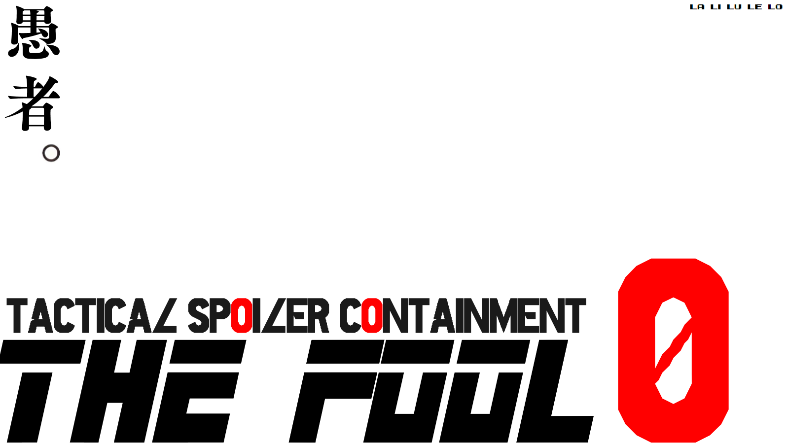
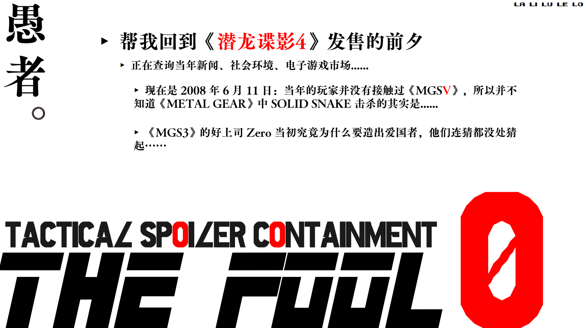

<div align="center">

[English](README.en.md) · **简体中文**

</div>



**一个让 AI 陪你玩老游戏的工具。它把当年玩家脑子里的东西还给你，顺便不剧透。**



---

## 它干什么

**一，把你装备成当年的玩家。**

这是它的主业。

老游戏玩不下去，一半原因不在游戏身上，是你缺了当年玩家白送的东西：那年的画面算什么水平、发售前所有人在等什么、上一部留下了哪些没解决的问题、哪些操作在那个年代属于常识。

最要紧的是**当年的悬念**。2008 年 6 月，全世界都在猜山猫的手臂到底怎么回事、十二人名单是谁。今天你搜任何一条，三秒钟拿到结论，于是那些问题从来没在你脑子里活过一天。

它去挖当年的论坛、杂志前瞻、预告片反响，然后把那些问题装回你脑子里。这部分它会实际联网检索，不靠记忆瞎编——查不到就直说查不到。

**二，不主动剧透。**

注意是"不主动"。它自己绝不往外倒后面的剧情，但你问什么它都接得住：这道具留不留、这段能不能跳、我卡住了往哪走，直接答。

碰上真会改变体验的问题，它不替你决定，先问一句"这个说了会影响你后面的体验，要听吗"。你说要就给，你说不要它才记下来，打完还你，一笔不落。

**三，陪你聊现在。**

打到一半想找人说话。刚才那段对话什么意思、这个角色我看不懂、这游戏到底在干什么，直接问。

它只用你已经看到的东西跟你聊，不拿后面的剧情解释前面。你现在读不懂的地方，它会说"现在读不懂是正常的"，然后陪你想。

文本量大的游戏最吃这个。极乐迪斯科那种满屏的概念和典故，你卡在一段对话上想聊两句，身边偏偏没有正在玩同一段的人。

它也不替你下结论。

**用起来就一句话**：跟它说"我想玩血源诅咒"。它问你一个问题，你就能开了。之后每次回来说一声打到哪了。

**打完那天**，你一路上问过、被扣下的答案会一次性还给你。当年发售后的评测、吵架、读者来信，也在那一刻整个解锁。你会拿到一个走完全程的人才有的视角：看着当年的人困惑，而你手里有答案。

## 为什么需要它

**因为你自己搜不到"当年"。**

搜索引擎是按相关度排的，不是按时间排的。你搜任何一部老游戏，返回的全是后来的复盘、解析、十周年回顾——那些文章带着答案写成，作者已经知道结局了。**你搜不到 2008 年 6 月那天的空气。**

要挖到当年，得会用 Wayback Machine 翻当年的页面、得知道去 GameFAQs 找那年的帖子、得把搜索词限定在发售之前。这是一份苦力活，而且你一边挖一边就被剧透了。

防剧透那部分则是另一回事：查个按键，搜索结果第三条标题就带着结局；问朋友一句，他说"我不剧透啊"然后就剧透了；攻略站的页面标题本身就是剧透，你点进去才知道晚了。

你想玩的那部经典，其实你已经知道结局了。不是你想知道的，是它自己漂进来的。等你终于坐下来玩，你不是在体验它，你是在核对答案。

这东西把你放回不知道的那一天。

---

## 为什么叫愚者

塔罗的 0 号牌。牌面上是一个人背着行囊、抬头望天，一只脚已经踏出悬崖边缘，浑然不觉。

那就是没被剧透的玩家的样子。不知道前面是路还是坑，照样走出去。

愚者是 0 号，它不在序列里，它在整副牌**之前**。所以这名字说的不只是你不知道，是你被放回了起点之前的位置。

---

## 它长什么样

同一局游戏的三个时刻。

### 开局

> **你**：我想玩血源诅咒
>
> **它**：血源，2015 年的，好东西。我去把它摸一遍，一分钟。
>
> *（它自己查了一轮，你什么都没看到）*
>
> **它**：好了。开之前问你一件事：这游戏你之前刷到过什么没？朋友提过的、视频里瞟到一眼的，梗也算，随便倒。魂系别的作品碰过吗？
>
> **你**：玩过只狼。血源就知道很难，还有什么克苏鲁？好像后期会变得很不一样？
>
> **它**：行。
> 那咱这么玩：你就当自己是 2015 年 3 月的人，那会儿全世界都以为这就是个换皮黑魂，这个误会很值钱。
> 说好三件事：后面有什么我不说；你什么都能问，能答的我直接答，不能答的我记着，打完还你；每次回来先说一声打到哪了。
> 进去前给你两样。一，别搜任何角色名加 ending，搜必炸。二，开场那段挫败是设计的一部分，不是你手残。
> 开吧。

留意它没干的事。你那句"好像后期会变得很不一样"，它一个字都没接。没说你猜对，没说你猜错，也没夸一句"最重要的都没漏"。那种话听着像安慰，其实是在告诉你还有更值钱的东西藏着。它只回了个"行"。

它也没纠正你可能记错的地方。你带着一个道听途说的印象进去，被游戏本身推翻，那个瞬间是你的。

三十秒，你回答了一个问题，然后带着比进来时更少的东西上路。

### 中途

> *（三小时后）*
>
> **你**：等一下，为什么这里的东西会变成这样？跟我一开始看到的完全不一样了
>
> **它**：这个说了会影响你后面的体验。要听吗？
>
> **你**：……算了，你记着吧。
>
> **它**：记下了，打完还你。
> 对了，这条线你要是觉得松紧不对，随时能调。

它没有替你决定。**它也不会说"这里有个惊天大秘密"**——那句话跟直接剧透一样坏，因为它已经告诉你那儿有个多大的东西。它只说"会影响"，不说"有多大"。

你要是回答"说吧"，它就直接说了，一个字不劝。规矩是你的。

### 通关

> *（三周后）*
>
> **你**：打完了
>
> **它**：先说说？
>
> **你**：……（你说了很多）
>
> **它**：那我把欠你的还了。三周前你问过为什么这里的东西会变成这样，现在能说了：（……）
> 另外，当年发售之后吵翻天的那些评论和争论，现在整个对你解锁了。要吗？

这是它存在的理由。所有被扣下的东西都有明确的归还时间。一个立了扣子不兑现的工具，比一个直接剧透的工具更坏。

---

## 什么游戏值得这么玩

不是所有游戏都需要。一个没有表达的游戏，你把信息环境重建得再完美，也不会发生任何事。

值得的大致两类。

**有年代的作品。** 能吃到全套：既挡住你不该提前知道的，也把当年玩家拥有的东西喂给你。

| 游戏 | 年份 | 为什么值得这么玩 |
|---|---|---|
| 寂静岭 2 | 2001 | 核心是一个必须你自己走完才成立的理解。提前拿到结论，过程就空了 |
| 塞尔达传说 时之笛 | 1998 | 它定义了 3D 冒险游戏的语法，而那些语法今天已经是空气。回到它还是新事物的那年，才知道当年为什么会炸 |
| 最终幻想 7 | 1997 | 它撞上了整个行业的转折点。不知道后来发生了什么，才能感受到当时的人在为什么激动 |
| 合金装备 3 | 2004 | 它的结局要你在毫无防备时被击中。知道会发生什么，那一击就落空了 |

**剧透即毁的作品。** 不一定老，但被剧透一次就永久损失。这类主要用守门那一半。

| 游戏 | 年份 | 为什么值得这么玩 |
|---|---|---|
| Outer Wilds | 2019 | 唯一的进度条是你的认知。被剧透的那部分会永久消失，重玩也找不回来 |
| Undertale | 2015 | 整个设计假设你是第一次见它。任何形式的预习都会让它对你失效 |
| 极乐迪斯科 | 2019 | 你对主角的判断随信息一点点重建。顺序被打乱，重建就不成立了 |
| INSIDE | 2016 | 全程无一句台词，理解全靠你自己拼。别人替你拼好了，就没有可拼的了 |

清单会继续长。你想玩的不在上面也没关系，直接把游戏名报给它，它会自己判断有没有当年可回。

---

## 安装

需要一个支持 Agent Skills 的环境。

**Claude Code**

```bash
git clone https://github.com/martinsin0223/the-fool ~/.claude/skills/the-fool
```

**Codex**

```bash
git clone https://github.com/martinsin0223/the-fool ~/.agents/skills/the-fool
```

**其他环境**：它本质上是一份行为约定，把 `SKILL.md` 整个贴给你的 AI 也能跑，只是跨会话记忆会弱一些。

更新：进到目录里 `git pull`。

**它需要联网搜索能力。** "回到当年"这半边完全依赖实时检索——当年的论坛、杂志前瞻、预告片反响，这些东西必须真的去查。如果你的环境没法联网，它会在开局就告诉你，然后退回到只做防剧透，而不是凭记忆给你编一个当年。

---

## 怎么用

开个对话，说一句：

> 我想玩血源诅咒

剩下的它会问你。之后每次回来，说一声打到哪了。

换设备、开新窗口、隔了三周，说"继续玩血源"就能接上。约定和欠你的账都还在。

---

## 它做不到的事

**它会犯错。** 它是个语言模型，不是滤网。它会尽全力守住，但没有任何机制能保证百分之百不漏。你自己那份克制仍然是主力。它管得住自己的嘴，管不住你的浏览器。

**它造不出动机。** 你要是其实并不想补这个游戏，它帮不了你。它服务的是"我错过了它，我想拿回来"的那种人。

**冷门游戏可能挖不到当年的东西。** 有些游戏当年就没什么声量，它会直接告诉你这块很薄，然后只做防剧透。它不会编"当年玩家都在猜什么"。宁可承认没有，也不给你假的。

**它不适合没有表达的游戏。** 一个只是好玩的游戏，用不着这么伺候。

---

## 关于这东西本身

它不完美，我也不打算假装它完美。

它从一次真实的游玩里长出来，然后被一个不认识它的 AI 从头审了一遍。那轮审查挖出二十来个问题，其中好几个是自相矛盾：它一边写着"不许形容藏了多大的东西"，一边在另一个文件里把"这笔账挺大"当成正确示范。这些改掉了，没被发现的肯定还有。

守门这件事没有下次改进的机会。它漏一次，你就少了一次。

所以两件事想请你做。

**别把它当保险箱。** 你自己那份克制仍然是主力。

**它做错了就当场骂它。** 挡太死了（你问什么都被记账）、说漏了、或者开始像客服一样说套话，直接告诉它。规矩是你的，你随时能改，它必须听。真觉得这东西该改，也欢迎来 issue 里说。

它更像一份口头约定，不像一个软件。约定靠不靠得住，取决于双方。

---

## 你的数据

所有记录都在你自己机器上：

```
~/.the-fool/<游戏名>/state.md
```

纯文本，随时打开看。Claude 和 Codex 共用同一份，换工具接着玩不丢档。

档案本身是零剧透的。它只记你问过什么问题、什么时候还，不记答案。翻自己的档案不会炸伤自己。

不打算再玩的时候，删掉那个文件夹就行。

---

一个游戏年龄≈真实年龄的电子游戏老婆罗门 做的。

拿去改，做成你自己的版本，不用问我。[MIT License](LICENSE)
